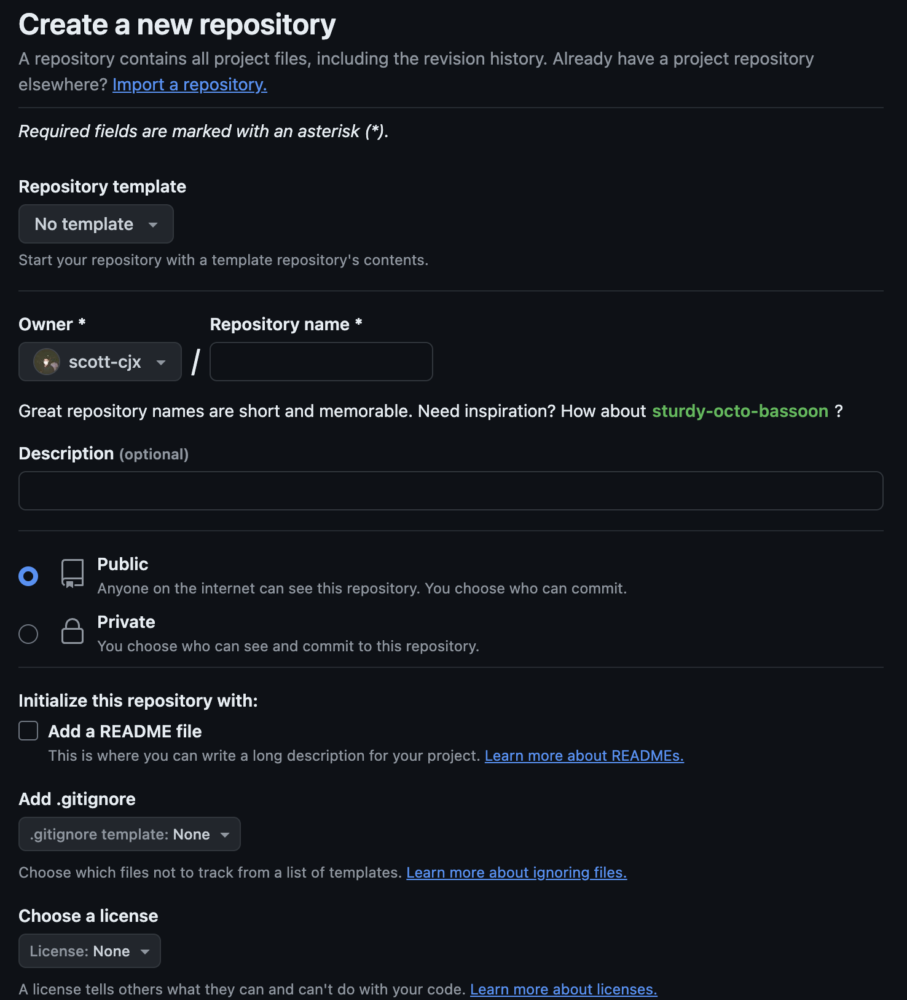
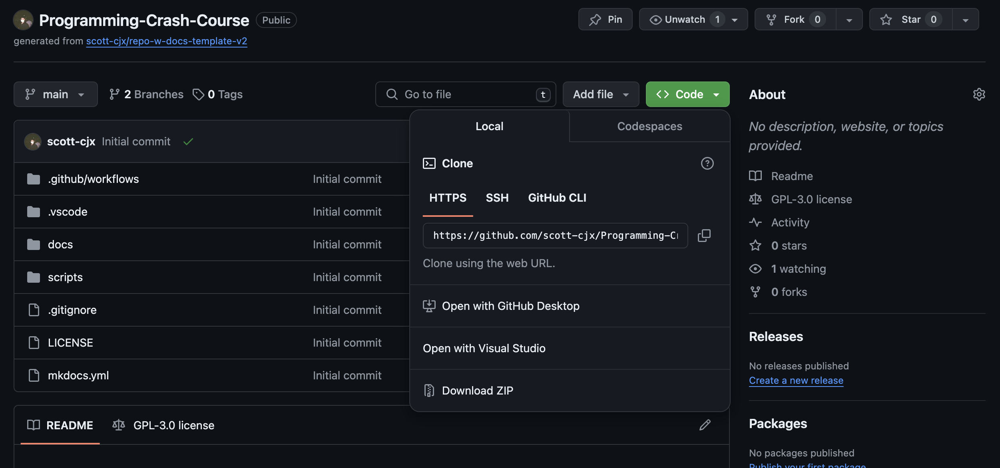

# Github

[Github](https://github.com/) is one the most essential tools a programmer can have.

It is basically a "Google Drive" but organised as if a file storage. 

Github has many uses but the most common use is to version and store code and documentation.

---

### Create a Github account.

follow this [link](https://github.com/signup) to sign up.

### Download Github locally

follow this [link](https://desktop.github.com/) to download Github Desktop, a Graphical User Interface version of Github. (for beginners)

### Create a repository

There are many ways to create a repository and link it to github, but this is one of the easier ways to do so.

1. Sign In to your account in Github
2. Goto My Repositories
3. Click on `new`, you should then be on this page

4. Fill out all information of your new repository (name, visibility, template (optional), gitignore, etc.)
5. Goto repository page
6. Click on (Green) `Code`, 

7. Select `Open with Github Desktop`
8. todo
